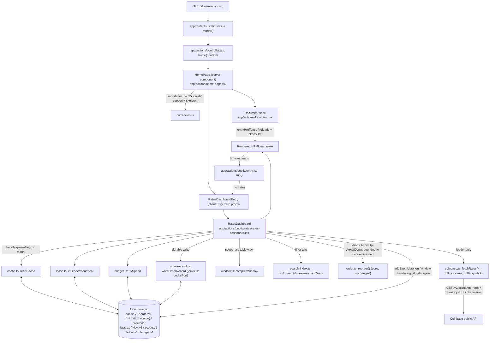

# System Design Brief: Crypto Rates Dashboard

Status: living — the feature has shipped (T1, T4, T5, plus the AC-76–82 view-toggle amendment)
and this pass adds T2 and T3. Source spec: `designs/README.md` (product/design handoff),
`designs/nocturne/*` (design tokens), `specs/crypto-dashboard.spec.md` (acceptance criteria +
Amendments), `docs/conventions.md` (curated, living conventions — read before touching this
tree). Target stack: **Remix 3** (`remix@3.0.0-beta.10`), the existing scaffold. ADRs
0001–0005 cover the original build; **ADR 0006 (T2) and ADR 0007 (T3), added by this pass,**
cover the "All" scope / windowed rendering and the versioned, lock-protected order record.

## Context & goals

A single-route dashboard (`routes.home = '/'`) lists live USD and BTC rates from Coinbase's
public exchange-rates endpoint. Users filter, sort, pin favourites, and drag-reorder the list
(curated 15 by default); the app must stay usable and honest when the feed is slow or down,
must never exceed a shared 10-requests-per-minute API budget across every open tab, and — as of
this pass — must also let a user see the *entire* Coinbase rate universe (500+ currencies) from
the same already-fetched response, and must protect the persisted order against a genuine
same-instant, two-tab write race. There is no backend of our own and no user accounts — all
cross-session state is browser-local (`localStorage`).

## Non-functional requirements

- **API budget:** ≤10 requests/minute, app-wide, shared across all tabs (leaky bucket, capacity
  10, continuous refill at 10/min — `BUDGET_CAP`/`BUDGET_WINDOW_MS` in `budget.ts`). **T2 adds
  zero new request paths** — "All" scope reads the same `fetchRates()` response the leader tab
  already pulls down.
- **Poll cadence:** one leader tab polls every 8s; lease handover within `LEASE_TTL=2500ms`.
- **Freshness tiers (T4):** live ≤12s · stale ≤120s (amber, trusted) · expired >120s (dimmed,
  red, banner). Applies uniformly to curated and "All"-scope rows.
- **No error page, ever:** every render path shows chrome plus last-known-good, an explicit
  "no cache yet" state, or dimmed expired data. Verified at the router-test layer.
- **First paint:** the server renders the cold-start skeleton with zero network calls and zero
  `localStorage` reads, from `currencies.ts`'s static symbol list alone; a returning visitor's
  browser upgrades it to cached numbers on its first post-hydration task.
- **Reorder durability:** the in-memory optimistic update is synchronous in the drop/keydown
  handler (instant visible feedback). The **durable** write (ADR 0007) is now asynchronous
  (`navigator.locks.request`) but still initiated in the same handler — a slightly weaker, but
  documented, guarantee than the fully-synchronous v1 write (see ADR 0007 consequences).
- **Bounded storage:** `history` (session Δ/sparkline samples) is recorded only for the curated
  15 plus currently-pinned symbols (ADR 0006) — bounded regardless of how many currencies
  Coinbase returns. The cached `rates` object may hold the full response (bounded by Coinbase's
  own currency count, not user-driven growth).
- **Accessibility:** keyboard-operable reorder (native, no external DnD library — ADR 0003), a
  2px focus-visible accent ring on every control, `aria-live="polite"` on the staleness label
  and reorder confirmations.
- **Scale:** curated 15, unwindowed (unchanged code path). "All" scope (500+) is windowed,
  table-view only (ADR 0006) — see Risks for why cards/grid stays unvirtualized.
- **Testability:** all pure logic (budget/lease/cache/order/sort/format/window/search-index/
  order-record) takes an injected clock and/or `KVStore`/`LocksPort`; no real timers, no real
  `localStorage`, no real `navigator.locks` in unit tests (CONV-testing-3).

## Component diagram



A second tab adopts the leader's cache/order/favs/view/scope writes via the native `storage`
event; it never calls `coinbase.ts` while another tab holds the lease.

## Project structure

**As shipped**, not as originally planned: `CONV-structure-3` already flags that the design
brief's original per-component file split (`toolbar.tsx`, `card.tsx`, `row.tsx`,
`sparkline.tsx`, `budget-meter.tsx`, `status-dot.tsx`, `view-toggle.tsx`, `icons.tsx`) was only
partially extracted — `history.ts` and `styles.ts` came out, but `rates-dashboard.tsx` itself is
a 705-line composition root. This pass adds more responsibility to that same tree; the module
split should be re-checked against this list during REFACTOR, not deferred indefinitely.

```
app/
  routes.ts, router.ts, assets.ts, middleware/render.tsx   # unchanged
  actions/
    controller.tsx                 # unchanged: home(context) => context.render(<HomePage/>)
    document.tsx                   # unchanged shell; links entryHref/entryPreloads + tokensHref
    home-page.tsx                  # static header/lede/footnote + <RatesDashboardEntry/>
    public/
      entry.ts                     # unchanged generic browser boot
      rates/
        rates-dashboard.tsx        # composition root: RatesDashboard (props: kv?/clock?/
                                    # fetchImpl?, per CONV-structure-2) + RatesDashboardEntry
                                    # (zero-prop clientEntry wrapper actually mounted)
        history.ts                 # appendHistory (now takes trackedSymbols), computeDelta
        styles.ts                  # shared css() descriptors
        tokens.css                 # Nocturne :root tokens + Inter font (CSS asset)
        currencies.ts              # SYMBOLS, DISPLAY_NAMES, + new displayNameFor() fallback
        coinbase.ts                # fetchRates() — already maps the FULL Coinbase response
        format.ts                  # formatUsd / formatBtc / formatDelta
        budget.ts                  # leaky-bucket store
        lease.ts                   # cross-tab polling lease
        cache.ts                   # last-known-good read/write + staleness tiers
        order.ts                   # reorder(): pure splice math — UNCHANGED by T2/T3
        order-record.ts            # NEW (T3): versioned OrderRecord, migration, locked write
        locks.ts                   # NEW (T3): LocksPort + real navigator.locks adapter,
                                    # SSR-safe guard
        sort.ts                    # sort strategies + pin-to-top
        search-index.ts            # NEW (T2): buildSearchIndex / matchesQuery
        window.ts                  # NEW (T2): computeWindow — pure, injected viewport metrics
        persisted.ts               # KVStore + readJSON/writeJSON/readOrder
        *.test.ts                  # colocated unit tests (no DOM), denied from the browser
                                    # bundle by the existing denyFiles rule
        *.test.browser.tsx         # colocated real-DOM/browser component tests, run via
                                    # `remix test` (CONV-testing-1) — NOT `node --test` directly
```

**Patterns, updated for this pass:**
- `order.ts` (pure reorder splice) and `order-record.ts` (versioned, locked persistence) are
  deliberately separate modules — reorder *math* doesn't change for T3; only how its result is
  durably stored does. Neither module needed to change for T2's windowing, since `reorder()`
  already operates on symbol identity within the full master array, never on rendered-list
  indices — windowing, like filtering before it, is transparent to it.
- `locks.ts`'s `LocksPort` is an injected-adapter seam (ports & adapters, same shape as
  `KVStore`): production wraps `navigator.locks`, tests inject a fake that can simulate
  contention deterministically, with an SSR-safe/unsupported-browser fallback that degrades to
  today's unlocked write rather than throwing.
- `window.ts`/`search-index.ts` follow the same pure-module, injected-input pattern as
  `budget.ts`/`lease.ts`: no DOM, fully unit-testable, real inputs (`scrollTop`,
  `viewportHeight`) supplied by `rates-dashboard.tsx`'s `on('scroll', ...)` handler.

## Data model

Still no database — client-only, versioned `localStorage` keys, each read through a validating,
fallback-safe helper (CONV-persistence-1).

### Persisted keys (localStorage, JSON, versioned, try/catch-guarded)

| Key | Shape | Writer | Reader | Status |
| --- | --- | --- | --- | --- |
| `nocturne.rates.cache.v1` | `{ rates, fetchedAt, history }` | leader, on fetch success | all tabs | shipped |
| `nocturne.rates.order.v1` | `Symbol[]` (bare) | — | migration source only | shipped, now read-only |
| `nocturne.rates.order.v2` | `{ schemaVersion, updatedAt, order }` | any tab, drop/keydown, via `writeOrderRecord` under a lock | all tabs (storage event, newer-wins) | **new (ADR 0007)** |
| `nocturne.rates.favs.v1` | `Symbol[]` (bare) | any tab, pin toggle | all tabs | shipped, unchanged (ADR 0007: deliberately not upgraded) |
| `nocturne.rates.view.v1` | `'cards' \| 'table'` | any tab, view toggle | all tabs | shipped (AC-77–82) |
| `nocturne.rates.scope.v1` | `'curated' \| 'all'` | any tab, scope toggle | all tabs | **new (ADR 0006)** |
| `nocturne.rates.lease.v1` | `{ id, ts }` | any tab, per 1s tick | all tabs | shipped |
| `nocturne.rates.budget.v1` | `{ tokens, ts, by }` | tab that spends a token | all tabs | shipped |

Validation rule, unchanged: unknown symbols dropped, missing valid ones appended (`order`/
`favs`); malformed JSON or an unrecognized `schemaVersion` falls back to a default instead of
throwing.

## T2 — "All" scope, windowing, search index (ADR 0006)

- **Scope toggle:** toolbar segmented control, `nocturne.rates.scope.v1`, default `'curated'`.
  Switching to `'all'` forces `view = 'table'` (writes `view.v1` too); switching `view` back to
  `'cards'` is disabled while `scope === 'all'`.
- **Symbol universe:** `Object.keys(rates)` once a fetch has resolved (already the full Coinbase
  response — no new fetch). Before any fetch resolves, "All" scope shows the same cold-start `—`
  skeleton as curated.
- **Display names:** `displayNameFor(symbol) = DISPLAY_NAMES[symbol] ?? symbol` — no static
  extension map (see ADR 0006 for why that was rejected).
- **Fiat:** included, not filtered — no type metadata to filter by; labeled neutrally.
- **Windowing (table view only):**
  ```
  export interface WindowMetrics { scrollTop: number; viewportHeight: number; rowHeight: number; overscan: number; itemCount: number }
  export interface WindowRange { startIndex: number; endIndex: number; topSpacerPx: number; bottomSpacerPx: number }
  export function computeWindow(metrics: WindowMetrics): WindowRange
  ```
  Fixed row height (e.g. `ROW_HEIGHT_PX = 40`, tuned in implementation), no DOM measurement.
- **Search index (all scopes):**
  ```
  export function buildSearchIndex(symbols: readonly string[], displayNameFor: (s: string) => string): Map<string, string>
  export function matchesQuery(index: Map<string, string>, symbol: string, query: string): boolean
  ```
  Built once per symbol-universe change, not per keystroke per row.
- **Reorderable universe stays bounded** to the curated 15 plus current pins — unpinned
  "All"-scope rows have no drag handle. `history`/Δ/sparkline are likewise only recorded for
  that same bounded set (`appendHistory`'s new `trackedSymbols` parameter); other "All"-scope
  rows show a live price with `—` Δ and a flat sparkline.

## T3 — durable, lock-protected order (ADR 0007)

```
export interface OrderRecord { schemaVersion: number; updatedAt: number; order: string[] }
export interface LocksPort { request<T>(name: string, fn: () => Promise<T> | T): Promise<T> }
export function readOrderRecord(kv: KVStore, validSymbols: readonly string[], clock: () => number): OrderRecord
export async function writeOrderRecord(kv: KVStore, locks: LocksPort, record: OrderRecord): Promise<void>
```

- `order.v1` is migrated once (on first `order.v2` read miss) into `{ schemaVersion: 1, updatedAt:
  clock(), order: <validated v1 array> }`, written to `.v2`; `.v1` is left in place, unread
  thereafter, never deleted (rollback safety).
- The write reads the current stored record inside `locks.request(...)` and only persists when
  the new record's `updatedAt` is **strictly greater** — ties favor the existing stored value.
- The `storage`-event listener adopts a newly-written `.v2` record only when its `updatedAt` is
  newer than the tab's in-memory value — same one-directional rule on the read side.
- `favs.v1` is **not** upgraded to this scheme — deliberately (ADR 0007: pin races are cheap to
  notice and redo; order races are not).

## API / contracts

**Coinbase:** `GET https://api.coinbase.com/v2/exchange-rates?currency=USD`, `AbortController`
7s timeout — unchanged. `usd = 1 / rates[sym]`; `btc = rates.BTC / rates[sym]` (invalid/NaN if
Coinbase's own `BTC` rate is missing/zero/negative, per AC-76). `mapRates` already returns every
symbol in the response, not just the curated 15 — this is the fact that makes T2 free of any new
request path.

## Key decisions & trade-offs

1. **Stack: Remix 3** (ADR 0001) — the existing scaffold, not React/RR7/Remix v2.
2. **Styling: Nocturne tokens as a CSS asset + `css()` mixins** (ADR 0002) — no Tailwind/shadcn.
3. **Drag-and-drop: native HTML5 DnD + a keyboard path, one shared pure `reorder()`** (ADR 0003)
   — no `@dnd-kit` (React-only, unusable here; also unusable for T2's windowed list, see ADR
   0006).
4. **Test stack: Remix's own tooling** (ADR 0004) — router tests, `remix/ui/test` component
   tests (now `*.test.browser.tsx` via `remix test`, CONV-testing-1), colocated unit tests with
   injected clock/`KVStore`/`LocksPort`.
5. **Data flow: server chrome + one client-hydrated dashboard, logic colocated under
   `public/rates/`** (ADR 0005) — not `app/utils/`, per the asset allowlist.
6. **T2: reuse the existing fetch response for "All" scope; hand-rolled table-only windowing;
   symbol-as-name fallback; fiat included** (ADR 0006) — zero new requests, zero new
   dependencies, cards/grid stays unvirtualized.
7. **T3: versioned `order.v2` record, written under `navigator.locks.request()`, `favs` left
   unlocked** (ADR 0007) — deterministic last-write-wins, not a CRDT merge; durability is now
   asynchronous but same-handler-initiated.

## Migration note

Nothing in the framework-level scaffold changes for this pass. New files only, inside
`app/actions/public/rates/`: `order-record.ts`, `locks.ts`, `window.ts`, `search-index.ts`, plus
extensions to `currencies.ts` (`displayNameFor`), `history.ts` (`trackedSymbols` parameter), and
`rates-dashboard.tsx` (scope toggle, windowed table rendering, lock-protected order writes).
`order.ts`, `sort.ts`, `cache.ts`, `budget.ts`, `lease.ts`, `format.ts` are unchanged.

**Repo `README.md`'s "Tension Decisions" section** still needs a follow-up edit (not made by
this design pass, consistent with how T1/T4/T5 were handled): flip T2 and T3 from "decided, not
implemented" to **IMPLEMENTED**, replacing their "Given up" text with the copy specified at the
end of ADR 0006 and ADR 0007 respectively.

## Risks & open questions

- **Cards/grid stays unvirtualized.** A user who wants "All" scope in a card layout can't have
  it — table view is forced. If product later wants a virtualized grid, it needs either a fixed
  column count or a container-width `ResizeObserver` measurement, neither of which this pass
  attempts; flag before promising it.
- **Fiat inclusion** may surprise a user expecting "All" to mean "all crypto." The neutral label
  ("All Coinbase currencies") is the mitigation; revisit if user feedback says otherwise.
- **Symbol-as-name** means "All" scope reads as a wall of tickers for anything outside the
  curated 15. Acceptable per ADR 0006's reasoning; a static extension map remains an option later
  if product wants it, reviewed like any data change, not a structural decision.
- **T3 residual race:** a genuine same-millisecond two-tab reorder still picks one winner and
  discards the other's intent — this ADR makes the outcome deterministic, not merged. True
  convergence needs a server-side per-user order or a CRDT, out of scope for a client-only app.
- **Web Locks API support:** on a browser without `navigator.locks` (or during SSR), the durable
  write silently degrades to the pre-T3 unlocked behavior — no crash, but no collision
  protection either. Worth a support-matrix check if this ever matters for the target audience.
- **`order.v1` is now dead weight** in every existing user's `localStorage` after their first
  post-upgrade visit — accepted for rollback safety; a future cleanup pass could prune it once
  rollback risk is judged closed.
- **Existing open question, unchanged:** exact Coinbase symbol availability for the curated 15
  is confirmed at implementation time; a missing curated symbol substitutes per the prototype's
  fallback list rather than crashing.

## Testability notes

- **Unit (no DOM):** `window.ts`'s `computeWindow` and `search-index.ts`'s
  `buildSearchIndex`/`matchesQuery` are pure functions over plain data/injected metrics — same
  testing shape as `budget.ts`/`lease.ts` (CONV-testing-3). `order-record.ts`'s
  `readOrderRecord`/`writeOrderRecord` take an injected `KVStore`, `clock`, and `LocksPort`; a
  fake `LocksPort` that queues/interleaves two `request()` calls proves the
  strictly-greater-`updatedAt` rule resolves contention deterministically without a real
  `navigator.locks`.
- **Migration test:** seed a fake `KVStore` with only `order.v1` set, call `readOrderRecord`,
  assert the returned record has `schemaVersion: 1` and the validated v1 order, and that `.v2` is
  now present in the fake store while `.v1` is untouched.
- **Component/browser (`*.test.browser.tsx`, via `remix test` — CONV-testing-1):** scope toggle
  forcing/locking table view; windowed table scroll producing the expected visible row range for
  a given fake `scrollTop`; drag-and-drop still restricted to curated+pinned rows in "All" scope;
  fiat rows rendering alongside crypto rows without a crash; a two-write-race scenario driven
  through a fake `LocksPort` and asserting the final persisted `order.v2` matches the
  strictly-newer write.
- **Visual QA (CONV-testing-4):** windowed table's scroll/spacer geometry, the disabled
  cards-view-toggle-while-scoped-to-all state, and fiat-row visual treatment all need a real
  render pass — attribute assertions won't catch a spacer height defect or a disabled-control
  affordance that's invisible in markup alone.
- **Regression guard:** curated-scope rendering (cards and table) is unchanged code paths;
  existing AC-1–82 coverage should continue to pass unmodified — a failure there signals an
  accidental coupling between the new scope/windowing logic and the existing curated path.
