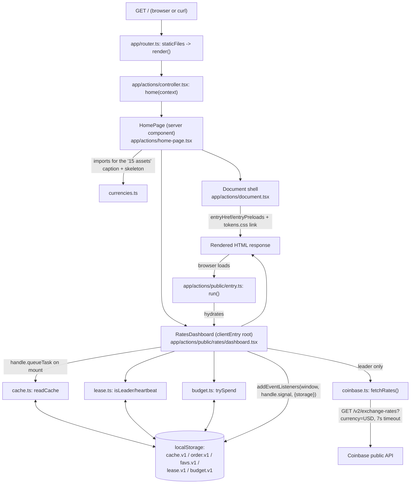

# System Design Brief: Crypto Rates Dashboard

Status: proposed. Source spec: `designs/README.md` (product/design handoff), `designs/nocturne/*`
(design tokens), `designs/Crypto Dashboard.dc.html` (algorithm reference only, not ported).
Target stack: **Remix 3** (`remix@3.0.0-beta.10`, the existing scaffold) — a server-first
framework with its own non-React component model. This supersedes an earlier draft of this
brief that assumed React Router v7; that draft is void. The handoff's React-specific
suggestions (shadcn/ui, Tailwind, `@dnd-kit`, `@tanstack/react-virtual`, its `app/routes/` +
`lib/` layout) are **adapted, not followed** — this brief ports their *intent* into
`.agents/skills/remix/SKILL.md`'s idioms.

## Context & goals

A single-route dashboard (`routes.home = '/'`) lists 15 curated cryptocurrencies with live USD
and BTC rates from Coinbase's public exchange-rates endpoint. Users filter, sort, pin
favourites, and drag-reorder the list; the app must stay usable and honest when the feed is
slow or down, and must never exceed a shared 10-requests-per-minute API budget across every
open tab. There is no backend of our own and no user accounts — all cross-session state is
browser-local (`localStorage`).

The existing Remix 3 scaffold **stays**: `server.ts`, `hmr.ts`, `app/router.ts`,
`app/routes.ts`, `app/middleware/render.tsx`, `app/assets.ts`, and the `app/actions/*`
conventions in `AGENTS.md`/`CLAUDE.md` are authoritative. This is additive work inside that
scaffold, not a rewrite of it.

## Non-functional requirements

- **API budget:** ≤10 requests/minute, app-wide, shared across all tabs of the same origin
  (leaky bucket, capacity 10, continuous refill at 10/min — ported verbatim from the
  prototype's `BUDGET_CAP=10`, `BUDGET_WINDOW=60000ms`).
- **Poll cadence:** one leader tab polls every 8s (7.5 req/min sustained), leaving ~2.5 req/min
  of budget headroom for manual refresh clicks from any tab.
- **Lease handover:** a leader that stops heartbeating is replaced within `LEASE_TTL=2500ms`.
- **Freshness tiers (T4):** live ≤12s · stale ≤120s (values still trusted, amber) · expired
  >120s (values dimmed, red, banner shown). Tier is always visible (dot + label + banner).
- **No error page, ever:** every render path shows chrome plus either last-known-good data, an
  explicit "no cache yet, retrying" state, or dimmed expired data — never a blank/error screen.
  This is testable at the **router** layer (see Testability notes).
- **First paint:** the server renders the full cold-start chrome (header, toolbar, 15 skeleton
  rows/cards with em-dash placeholders) with **zero network calls and zero `localStorage`
  reads** — it comes from `currencies.ts`'s static symbol list alone. A returning visitor's
  browser then upgrades that same markup to cached numbers on its first post-hydration task,
  before any fetch resolves.
- **Reorder durability:** a drop writes to `localStorage` synchronously in the same handler: an
  immediate reload cannot lose the last drag (T3, partial — see Risks).
- **Accessibility:** keyboard-operable reorder (native, no external DnD library — see ADR
  0003), 2px focus-visible accent styling on every control, `aria-live="polite"` on the
  staleness label and on reorder confirmations.
- **Scale (current):** 15 assets, no virtualization. Seam documented for T2 (500+ items) below;
  not built this pass.
- **Testability:** budget/lease/cache/order/sort/format logic must be unit-testable with no
  real DOM, no real timers, no real `localStorage` (injected clock + storage).

## Component diagram



A second tab's `RatesDashboard` instance runs the identical code path; it never calls
`coinbase.ts` while another tab holds the lease. It adopts the leader's writes via the native
`storage` event (`addEventListeners(window, handle.signal, { storage: onStorage })` per
`component-model.md`), so N tabs cost the same as one.

## Project structure

Everything new is **route-local**, since this is a single-route app (`routes.home`). Per the
skill's placement precedence ("if it belongs to one route, keep it with that route" outranks
promoting to `app/utils/`), and per the asset server's security boundary
(`allowFiles: ['app/routes.ts', 'app/**/public/**']` in `app/assets.ts`), every module that is
part of the hydrated client bundle's import graph **must** physically live under an
`app/**/public/**` directory or the browser's request for that module 404s. Since all of this
feature's logic (fetch, budget, lease, cache, order, sort, format) runs client-side only (ADR
0005), it all lives under `app/actions/public/rates/` rather than `app/utils/` — a deliberate,
documented deviation from the generic "pure helpers go in `app/utils/`" guidance, forced by the
asset allowlist, not a stylistic choice (see ADR 0005 for the full reasoning).

```
app/
  routes.ts                        # unchanged: routes.home = '/' already covers this feature
  router.ts                        # unchanged
  assets.ts                        # unchanged allowFiles rule; add tokensHref alongside entryHref
  middleware/render.tsx            # unchanged
  actions/
    controller.tsx                 # unchanged: home(context) => context.render(<HomePage/>)
    document.tsx                   # unchanged shell + one new <link> for tokens.css
    home-page.tsx                  # rewritten: static dashboard chrome (header/lede/footnote)
                                    # + <RatesDashboard/>; starter content deleted (see Migration)
    public/
      entry.ts                     # unchanged generic browser boot (run/loadModule/resolveFrame)
      rates/                       # the whole feature, route-local, named by responsibility
        dashboard.tsx              # clientEntry root: toolbar + budget strip + banner + list
        toolbar.tsx                # filter input, segmented sort control, refresh, auto checkbox
        budget-meter.tsx           # 10-pip strip + role label
        status-dot.tsx             # staleness dot + label, aria-live="polite"
        card.tsx                   # grid view, one card
        row.tsx                    # table view, one row
        view-toggle.tsx
        sparkline.tsx              # 68x22 polyline, pure SVG from a number[]
        icons.tsx                  # inline Phosphor SVGs (DotsSixVertical, PushPin, PushPinSlash)
                                    # — same hand-authored-inline-SVG pattern already used in
                                    # the starter's home-page.tsx (AtomIcon, GitHubIcon, ...)
        styles.ts                  # shared css() style descriptors: outline button, fading
                                    # hairline gradient, focus ring — reused visual recipes only
        tokens.css                 # Nocturne :root tokens + Inter font, a plain CSS asset
        currencies.ts              # SYMBOLS + display names (single source of truth)
        coinbase.ts                # fetchRates(): typed client + response mapping
        format.ts                 # formatUsd / formatBtc / formatDelta
        budget.ts                  # leaky-bucket token store (injected KVStore + clock)
        lease.ts                   # cross-tab polling lease (same pattern as budget.ts)
        cache.ts                   # last-known-good read/write + staleness(fetchedAt, now)
        order.ts                   # reorder(): T5 master-order drag semantics, pure
        sort.ts                    # sort strategies: custom | name | usd | delta + pin-to-top
        persisted.ts               # typed KVStore + readJSON/writeJSON, versioned keys
        types.ts
        *.test.ts / *.test.tsx     # colocated; already excluded from the browser bundle by
                                    # the existing denyFiles: ['app/**/*.test.*'] rule
```

**Patterns chosen:**
- **Ports & adapters (hexagonal-lite):** `currencies.ts`/`format.ts`/`budget.ts`/`lease.ts`/
  `cache.ts`/`order.ts`/`sort.ts`/`persisted.ts` are the domain/application core, DOM-free and
  router-free; `coinbase.ts` is the one IO adapter (fetch), swappable behind its exported
  function signature for tests.
- **Repository-shaped KV wrapper (`persisted.ts`):** a minimal `KVStore` interface
  (`getItem`/`setItem`, satisfied by real `Storage` or an in-memory fake) plus versioned,
  schema-validated read/write — every persisted key degrades to a default instead of throwing.
- **Strategy pattern (`sort.ts`):** one comparator per `SortMode`, composed with a pin-to-top
  decorator, so adding a sort mode never touches rendering code.
- **Single stateful composition root (`dashboard.tsx`):** Remix Components have no hooks;
  `RatesDashboard`'s setup scope holds every piece of state as plain `let` variables (`order`,
  `favs`, `rates`, `fetchedAt`, `history`, `filter`, `sort`, `auto`, `failures`, `now`,
  `dragSym`, `overSym`) and wires the pure modules together in one place, exactly mirroring the
  handoff's "one `useRates` hook" intent without hooks. Child components (`Toolbar`,
  `BudgetMeter`, `Card`, `Row`, ...) stay presentational — they read already-formatted values
  from props and never call `fetch`, `Date.now()`, or `localStorage` themselves.
- **Observer via native `storage` event:** cross-tab sync uses
  `addEventListeners(window, handle.signal, { storage: onStorage })` — no extra pub/sub
  dependency, cleanup is automatic on component disconnect.
- **Dependency injection via optional props, not context:** `RatesDashboard` accepts optional
  `kv?: KVStore`, `clock?: () => number`, `fetchImpl?: typeof fetchRates`, defaulting to real
  `localStorage`/`Date.now`/`fetchRates` in production. `home-page.tsx` never supplies them, so
  production hydration only ever serializes the (empty) default props — the
  "`clientEntry` props must be serializable" rule is never at risk. Tests that need fakes mount
  `RatesDashboard` directly via `remix/ui/test`'s `render(...)`, which is a same-process DOM
  render, not a hydration/serialization round-trip, so passing function values there is safe.

## Data model

No database — this is a client-only app against a third-party public API; the only persistence
is versioned `localStorage` keys, each read through a validating helper that falls back to a
default rather than throwing.

### In-memory state (setup-scope variables inside `dashboard.tsx`)

| State | Type | Notes |
| --- | --- | --- |
| `order` | `Symbol[]` | master symbol order; persisted |
| `favs` | `Symbol[]` | pinned symbols; persisted |
| `rates` | `Record<Symbol, { usd: number; btc: number }> \| null` | last-known-good |
| `fetchedAt` | `number \| null` | epoch ms of newest good response |
| `history` | `Record<Symbol, number[]>` | up to 48 USD samples/symbol, for Δ + sparkline |
| `filter` | `string` | |
| `sort` | `"custom" \| "name" \| "usd" \| "delta"` | |
| `auto` | `boolean` | |
| `failures` | `number` | consecutive failed attempts |
| `now` | `number` | single 1s tick (`setInterval` cleared on `handle.signal` abort); every time-derived label reads from it |
| `dragSym` / `overSym` | `Symbol \| null` | transient drag state, not persisted |

### Persisted keys (localStorage, JSON, versioned, try/catch-guarded)

| Key | Shape | Writer | Reader |
| --- | --- | --- | --- |
| `nocturne.rates.cache.v1` | `{ rates, fetchedAt, history }` | leader tab, on fetch success | all tabs, on mount + `storage` event |
| `nocturne.rates.order.v1` | `Symbol[]` | any tab, on drop or keyboard move | all tabs |
| `nocturne.rates.favs.v1` | `Symbol[]` | any tab, on pin toggle | all tabs |
| `nocturne.rates.lease.v1` | `{ id: string \| null; ts: number }` | any tab, per 1s tick | all tabs (decides who polls) |
| `nocturne.rates.budget.v1` | `{ tokens: number; ts: number; by: string }` | tab that spends a token | all tabs (renders pips, gates own spend) |

Validation rule for every key: unknown symbols are dropped, missing ones appended (for `order`);
malformed JSON or a version mismatch falls back to the default rather than throwing.

## API / contracts

**Coinbase:** `GET https://api.coinbase.com/v2/exchange-rates?currency=USD`, `AbortController`
7s timeout.

```
interface CoinbaseRatesResponse {
  data: { currency: string; rates: Record<string, string> }
}
```

Response gives **units of `sym` per 1 USD**, so:
- `usd = 1 / rates[sym]` (price of 1 `sym` in USD)
- `btc = rates.BTC / rates[sym]` (cross rate; BTC's own card shows `—`)

### `app/actions/public/rates/*` exported surface (types only)

```
// currencies.ts
export const SYMBOLS: readonly Symbol[]          // exactly 15
export type Symbol = typeof SYMBOLS[number]
export const DISPLAY_NAMES: Record<Symbol, string>

// coinbase.ts
export interface FetchedRates {
  rates: Record<Symbol, { usd: number; btc: number }>
  fetchedAt: number
}
export function fetchRates(signal?: AbortSignal): Promise<FetchedRates>

// budget.ts
export interface BudgetState { tokens: number; ts: number }
export interface BudgetStore {
  read(now: number): BudgetState
  trySpend(now: number): boolean          // false when the bucket is empty
}
export function createBudgetStore(kv: KVStore, clock: () => number): BudgetStore

// lease.ts
export interface LeaseStore {
  isLeader(now: number, tabId: string): boolean
  heartbeat(now: number, tabId: string): void
  release(tabId: string): void
}
export function createLeaseStore(kv: KVStore, clock: () => number): LeaseStore

// cache.ts
export type Staleness = "live" | "stale" | "expired" | "none"
export function staleness(fetchedAt: number | null, now: number): Staleness
export interface RatesCache {
  rates: Record<Symbol, { usd: number; btc: number }>
  fetchedAt: number
  history: Record<Symbol, number[]>
}
export function readCache(kv: KVStore): RatesCache | null
export function writeCache(kv: KVStore, cache: RatesCache): void

// order.ts — T5 semantics: master-order reorder, filter-slice-agnostic
export function reorder(
  order: Symbol[], dragged: Symbol, target: Symbol, position: "before" | "after"
): Symbol[]

// sort.ts
export type SortMode = "custom" | "name" | "usd" | "delta"
export function sortSymbols(
  mode: SortMode, symbols: Symbol[], favs: Symbol[],
  rates: Record<Symbol, { usd: number; btc: number }> | null,
  deltas: Record<Symbol, number>
): Symbol[]

// persisted.ts
export interface KVStore { getItem(k: string): string | null; setItem(k: string, v: string): void }
export function readJSON<T>(kv: KVStore, key: string, fallback: T, validate?: (v: unknown) => v is T): T
export function writeJSON<T>(kv: KVStore, key: string, value: T): void

// dashboard.tsx
export interface RatesDashboardProps {
  kv?: KVStore                          // test seam only — never passed by home-page.tsx
  clock?: () => number                  // test seam only
  fetchImpl?: typeof fetchRates         // test seam only
}
export const RatesDashboard: /* clientEntry-wrapped component */
```

### Route contract

`app/actions/controller.tsx`'s existing `home(context)` action is unchanged in shape: it still
returns `context.render(<HomePage />)`. `HomePage` performs **no data fetching** — it renders
the static header/lede/footnote plus `<RatesDashboard />`, whose own setup-phase defaults (no
rates yet) are what the server actually streams out, giving the cold-start skeleton for free
(see ADR 0005).

## Budget / lease / staleness mechanisms (ported from the prototype, unchanged constants)

- **Budget:** leaky bucket, `BUDGET_CAP = 10`, refilling continuously over
  `BUDGET_WINDOW = 60_000ms`. `trySpend` computes
  `tokens = min(CAP, prev.tokens + (now - prev.ts) / WINDOW * CAP)`, spends 1 if `>= 1`, else
  refuses (button reads "Wait Ns"). Manual refresh and the poll tick draw from the same bucket.
- **Lease:** heartbeat record `{ id, ts }`. A tab is leader if it already holds the lease, no
  one holds it, or the holder is silent for `LEASE_TTL = 2500ms`. Only the leader polls; every
  tab reads the same cache key for free via the `storage` event.
- **Staleness:** `now - fetchedAt` thresholds at `12_000ms` (live) and `120_000ms` (expired);
  between is `stale`. No cache at all is `"none"` (first-visit copy, not an error).

## Key decisions & trade-offs

Each decision below has a corresponding ADR under `docs/adr/`.

1. **Stack: Remix 3, per explicit constraint** — the existing scaffold stays; the handoff's
   React-specific suggestions are adapted, not followed. Trade-off: no access to shadcn/ui,
   `@dnd-kit`, or the React ecosystem's testing/virtualization libraries; gains zero migration
   risk and full alignment with the repo's own skill and conventions.
2. **Styling: Nocturne tokens as a plain CSS asset (`tokens.css`) + `css()` mixins**, not
   Tailwind/shadcn. Global `:root` custom properties and the Inter `@import` live in one CSS
   asset served through the existing asset pipeline and linked from `Document`'s `<head>`;
   per-component visuals (card, row, outlined buttons, fading hairlines) are `css(...)` mixin
   descriptors that consume `var(--color-*)` — never a literal hex. Trade-off: no ready-made
   component library, so every Nocturne class (`.btn-primary`, `.seg`, `.table` row rules) is
   hand-ported once into a small shared `styles.ts`; gains zero new dependencies and a styling
   layer that already matches this repo's demonstrated pattern (`css()` mixins are used
   throughout the existing starter).
3. **Drag and drop: native HTML5 DnD (`draggable` + `on('dragstart'|'dragover'|'drop', ...)`)**,
   like the prototype, plus a keyboard path (`ArrowUp`/`ArrowDown` on the drag handle via
   `on('keydown', ...)`) that calls the identical pure `reorder()` function so pointer and
   keyboard share one code path and one `aria-live` confirmation. Trade-off: more manual wiring
   than a DnD library provides (no built-in sensors, auto-scroll, or virtualization hooks);
   gains zero new dependencies and a direct, testable seam (`order.ts`) independent of any
   pointer/keyboard simulation. `remix/ui/animation`'s `animateLayout(...)` mixin gives the
   drop-settle reflow animation without extra code.
4. **Testing: Remix's own tooling exclusively** — router tests via `router.fetch(new
   Request(...))` for the "no error page ever" cold-start assertion; component tests via
   `remix/ui/test`'s `render(...)` for interactive behavior (filter, sort, drag, keyboard
   reorder, budget/staleness display); plain `describe`/`it` + `remix/assert` unit tests,
   colocated next to each pure module in `rates/`, with an in-memory `KVStore` fake and a
   manually-advanced `clock` for deterministic cross-tab race simulation. Trade-off: no
   Playwright/real-second-tab coverage in this pass, so the actual two-*browser*-tab lease
   handover is verified only by simulation (two `tabId`s against one fake store), not by a real
   `storage` event firing across real windows — flagged as an open question below, not built
   now, consistent with the course correction's scope (Remix 3's own tooling only).
5. **Data flow: server renders static chrome, client hydrates one `RatesDashboard` clientEntry
   under `app/actions/public/rates/`, pure logic colocated there (not `app/utils/`)** — the
   asset server's `allowFiles: ['app/routes.ts', 'app/**/public/**']` means every module in the
   hydrated bundle's import graph must live under `public/`; since all Coinbase/budget/lease/
   cache logic is client-only, it lives there rather than in the generically-suggested
   `app/utils/`, which would 404 in the browser. Trade-off: a deliberate, documented deviation
   from the general "pure helpers go in utils" guidance, justified by the asset allowlist, not
   by convenience.

## Migration note (existing scaffold)

The Remix 3 scaffold **stays** — nothing is deleted at the framework level:

- **Kept as-is:** `server.ts`, `hmr.ts`, `app/router.ts`, `app/routes.ts`,
  `app/middleware/render.tsx`, `app/assets.ts` (one addition: a `tokensHref` alongside
  `entryHref`/`entryPreloads`), `app/actions/controller.tsx` (unchanged shape),
  `app/actions/document.tsx` (unchanged shell, one new `<link>` tag),
  `app/actions/public/entry.ts` (generic, route-agnostic — untouched), `.agents/skills/remix/*`
  (authoritative), `AGENTS.md`/`CLAUDE.md` conventions, `public/` static passthrough.
- **Rewritten:** `app/actions/home-page.tsx` — the starter's Remix-branding content (Masthead,
  Columns, GetStartedCard, CodingWithAiCard, Footer, all wordmark/social SVGs) is deleted and
  replaced by the dashboard's static header/lede/footnote plus `<RatesDashboard />`.
- **Removed:** `app/actions/public/prompt-button.tsx` (starter demo component, no longer
  referenced) — its `clientEntry` pattern is the template `dashboard.tsx` follows, so keep it
  as a reference during implementation if useful, then delete.
- **Added:** the entire `app/actions/public/rates/` tree described above.
- **Deferred to implementation, not part of this brief:** the repo `README.md`'s "Tension
  Decisions" section (content largely already written in `designs/README.md`'s T1–T5) — flagged
  here for the implementation/spec step, not written by this design pass.

## Risks & open questions

- **T1 given-up race:** `localStorage` reads/writes are not atomic; two tabs can both win a
  token in the same millisecond, overdrawing the bucket by ~1. Accepted as a soft budget with
  ~2.5 req/min headroom. A production-grade fix is a server-side proxy owning the Coinbase key
  and the quota — out of scope, and the reason ADR 0005 keeps this client-only for now.
- **T2 (500+ assets) seam, not built:** windowed rendering (manual, since no virtualization
  library is in play) over the filtered array, filtering kept off the interaction path, cards
  memoised by keeping their render output stable when props are unchanged, and the drag
  interaction restricted to a rendered window with edge auto-scroll if ever needed. Flag before
  scaling past ~50 assets; Remix 3 has no off-the-shelf virtualization primitive, so this would
  be hand-rolled.
- **T3 (durable, lock-protected order) seam, not built:** today's optimistic + synchronous
  write survives a solo reload but not a same-instant race between two tabs (last-write-wins).
  The documented upgrade is a versioned record `{ version, updatedAt, order }`, a `storage`
  listener adopting a newer version, and read-time validation. True convergence across devices
  needs a server-side per-user order — out of scope for a client-only app.
- **Open question — real two-tab test coverage:** should a manual QA pass (two real browser
  tabs) or a future Playwright addition verify the actual `storage`-event handover, beyond the
  deterministic unit simulation described in ADR 0004? Default for this brief: unit simulation
  is sufficient; add real-browser coverage only if the team decides the risk warrants a second
  test runner.
- **Open question:** does the product ever need cross-device order sync (not just cross-tab)?
  Default assumption: **no** — flag to product before building a server-side order store.
- **Open question:** confirm the exact 15 symbols and their Coinbase availability; treat a
  missing symbol as a `—` render, not a crash, in `currencies.ts`/`format.ts`.
- **SSR/hydration match:** `RatesDashboard`'s server-rendered output (setup-phase defaults) and
  its first client render (before the mount `queueTask` resolves) must match, or hydration will
  visibly flash. Since both paths run the exact same component function with the same default
  state, this should hold by construction — call it out explicitly in code review and cover it
  with the router test's cold-start assertion.

## Testability notes

- **Router test (cheapest, no DOM):** `router.fetch(new Request('http://localhost' +
  routes.home.href()))` asserts `status === 200` and that the body contains the expected
  cold-start markup (header text, "Coinbase · 15 assets", all 15 symbols with `—`
  placeholders, the `aria-live` region) and contains no error text — this directly
  operationalizes "no error page, ever" at the router layer.
- **Unit (no DOM):** `budget.ts`, `lease.ts`, `cache.ts`, `order.ts`, `sort.ts`, `format.ts`,
  `persisted.ts` — every one takes an injected `KVStore` and/or `clock`. Cross-tab races are
  tested by calling the same store instance twice with different `tabId`s and hand-set `now`
  values; no real timers, no real `localStorage`, no flakiness.
- **Component (`remix/ui/test`'s `render(...)`):** mount `RatesDashboard` directly with fake
  `kv`/`clock`/`fetchImpl` props, exercising filter → sort → pin → drag (simulated
  `dragstart`/`dragover`/`drop`) → keyboard reorder (simulated `keydown`) → reload, and
  asserting budget pip counts/labels and staleness tiers after advancing the injected clock and
  calling `result.act(...)`.
- **Seam for future backend (T1 upgrade):** `coinbase.ts`'s `fetchRates` signature is the only
  network call in the app — a server-side proxy would replace its implementation without
  touching `dashboard.tsx` or any presentational component.
